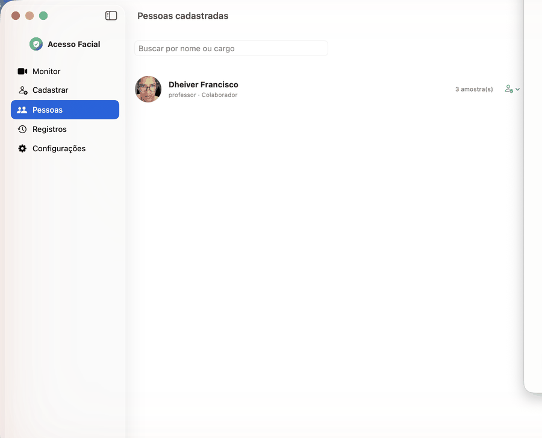

# Acesso Facial (Facial Access)



Native facial-recognition software for macOS — camera-based access control, 100% local, with no external dependencies (Python, third-party CoreML, cloud). Written in Swift/SwiftUI, using only system frameworks (AVFoundation + Vision).

## Features

- **Monitor**: live camera feed with recognition of **multiple simultaneous faces** (each face shown with name and confidence). The primary face (closest to the camera) drives the access decision — grants (green), denies (red), or flags unknown (yellow).
- **Anti-spoofing (liveness check)**: requires a blink/movement before granting access, blocking attacks with a photo or static video. Configurable.
- **Watchlist**: each person can be marked **Normal**, **Alert** (grants + notifies) or **Blocked** (denies + alarm). Detecting a watchlisted person on any face in frame triggers a **sound + system notification**.
- **Enroll**: captures 1–5 face samples, with name, role, access level, and watchlist status.
- **People**: list, search, enable/disable, change status (watchlist), and remove entries.
- **Logs**: access log (granted/denied/blocked/alert/unknown) with thumbnail, timestamp, and confidence. **Search**, **filter by result**, and **CSV export** for auditing.
- **Settings**: confidence threshold, liveness check and alert sound toggles, camera selection.

## How it works (technical)

- **Detection**: `VNDetectFaceLandmarksRequest` (Vision) locates faces and facial landmarks in each camera frame.
- **Recognition**: the detected face is cropped and passed through `VNGenerateImageFeaturePrintRequest`, producing an image signature (embedding). The live signature is compared by distance (`computeDistance`) against enrolled signatures; the smallest distance above the configured threshold grants access.
- **Liveness check**: variation in eye openness (via landmarks) over a short window — a live face blinks/moves, a static photo doesn't. Covers the most common presentation attack (printed photo / phone screen).
- **Persistence**: people, samples (signatures archived via `NSSecureCoding`), and the access log are saved as JSON under `~/Library/Application Support/AcessoFacial/`. No data leaves the machine.

## Build

Only requires the Command Line Tools (no full Xcode needed):

```bash
bash build_app.sh              # produces "~/Desktop/Acesso Facial.app" (release)
bash build_app.sh --debug      # debug build
```

First run: right-click → Open (ad-hoc signed app, not notarized).

## Tests

```bash
bash run_tests.sh              # headless sanity tests (no camera)
```

## Privacy

All processing (detection, recognition, storage) runs locally on the Mac. No image, face, or biometric data is ever sent to external servers.
